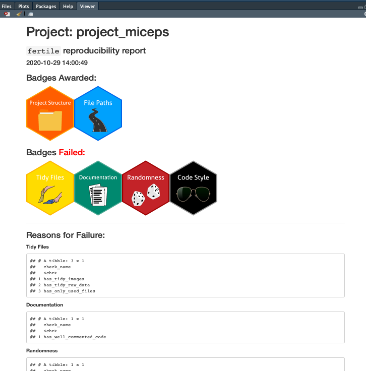

<!-- README.md is generated from README.Rmd. Please edit that file -->

```{r, echo = FALSE, message = FALSE, warning = FALSE}
knitr::opts_chunk$set(
  collapse = TRUE,
  comment = "#>",
  fig.path = "README-"
)
library(fertile)
library(tidyverse)

noob <- system.file("extdata/project_noob.zip", package = "fertile") %>%
  sandbox()

miceps <- system.file("extdata/project_miceps.zip", package = "fertile") %>%
  sandbox()
```

[](https://travis-ci.org/baumer-lab/fertile)
[](https://codecov.io/gh/baumer-lab/fertile?branch=master)
[](https://lifecycle.r-lib.org/articles/stages.html#stable)


# fertile: creating optimal conditions for reproducibility 

The goal of `fertile` is to make creating a reproducible project as easy as possible, for users of all levels of sophistication.

`fertile` provides a wide variety of checks that can be run on your project to test different aspects of its reproducibility--including clean project structure, portability of paths, and use of randomnes--as well as several functions that will create reproducibility reports for you with information about referenced packages and file paths.

## Installation

You can install `fertile` from GitHub with:

```{r gh-installation, eval = FALSE}
# install.packages("devtools")
devtools::install_github("baumer-lab/fertile")
```

## Reproducibility Reports

From within any R project directory, you can create a report of reproducibility with `proj_test()` or its smaller component functions.

This report will contain information about packages referenced in project code, files in your directory and suggestions for reorganizing them, as well a list of absolute and/or non-portable paths passed to functions in your code.

```{r example 1, warning = FALSE, error=TRUE}
proj_test(noob)
```

## Reproducibility Checks

There are several functions allowing you to run checks on project reproducibility.

The function `proj_check()` runs 16 different tests to check your project for reproduciblity, and provides a summary of checks that you passed as well as ones to work on and how to improve them. Each of these checks can also be run individually.

`proj_check_some()` will complete a selection of the checks run by `proj_check()`, specified by the user through a `dplyr::select`-style statement.

```{r example 2, warning = FALSE, message = FALSE}
proj_check_some(miceps, contains("tidy"), ends_with("root"), has_only_used_files)
```

## Reproducibility Badges

Users looking for a more visual summary of their reproducibility success can do so using `proj_badges()`. This function, when run on an R Project directory, builds an html summary document containing information about which reproducibility components were met, which ones failed, and areas on which to focus for improvement.

Additionally, the document contains information about the R version, computer operating system, user, and list of files that were used in the generation of the reproducibility summary.

The results of `proj_badges()` look like the example below:

```{r badges, eval = FALSE}
proj_badges(miceps)
```

**List of components that were met/failed + areas to focus on for improvement:**



**Technical information about how the report was generated:**


Users can also run the reproducibility checks associated with each badge---interactively, instead of producing an html report---using the `proj_check_badge()` function, which takes an argument for the badge name. See the example below, where all the functions for the documentation badge are run on a sample project:

```{r check_badge}
# Options include: "documentation", "tidy-files", "structure",
# "style", "randomness", and "paths"
proj_check_badge(miceps, "documentation")
```


## Fertile's Operating Modes

`fertile` has two modes:

-   diagnostic or retrospective
-   interactive or prospective

Reproducibility reports and checks make up the diagnostic part of `fertile`. The interactive component comes from a system of path logging:

## Logging and Reporting of Paths

When you have `fertile` loaded, the package will interactively edit a log file located in your project directory, which will record the paths/arguments passed to commonly-used input and output functions that you execute in files or in the console. You can access this file using `log_report()`, which reads the log, and `log_clear()`, which erases the log and starts it over.

```{r example 3, message = FALSE, warning = FALSE, error=TRUE}
log_clear()
library(mime)
library(fertile)
set.seed(10)
read.csv("tests/testthat/data/data.csv")
log_report()
```

```{r example 4, message = FALSE}
log_clear()
log_report()
```

The retrospective functions `proj_check()`, `proj_check_some()`, `proj_test()`, and the functions related to them harness this same logging system to produce reports. However, all editing of the interactive log is independent from the retrospective log, which is not user-accessible.

### Adding New Functions To Check Paths For

`fertile`, by default, contains a set list of common functions (such as `read.csv()` from the `base` package and `read_csv()` from `readr`) for which it can interactively/retroactively catch file path issues.

These are:

-   `utils`: read.csv, read.csv2, read.delim, read.delim2, read.DIF, read.fortran, read.fwf, read.table, write.csv

-   `readr`: read_csv, read_csv2, read_delim, read_file, read_file_raw, read_fwf, read_lines, read_lines_raw, read_log, read_table, read_table2, read_tsv, write_csv

-   `base`: read.dcf, load, source, save

-   `readxl`: read_excel

-   `stats`: read.ftable

-   `rjson`: fromJSON

-   `foreign`: read.dta, read.mtp, read.spss, read.systat

-   `sas7bdat`: read.sas7bdat

-   `ggplot2`: ggsave

Users may have a desire to add additional functions to the list that can be checked for file path errors. `fertile` provides several ways in which to edit this list:

The `add_shim()` function allows users to add a single function to the list:

```{r addshim, eval = FALSE}
# Add stats::write.ftable to the list of functions that fertile checks for path issues

add_shim(func = "write.ftable", package = "stats")
```

To get a summary of all potential functions that could be added to the list, users can use `find_all_shimmable_functions()`, which looks through all of the currently loaded packages in `search()` to find functions that use file paths.

If desired, all of the functions found by `find_all_shimmable_functions()` can be added to `fertile`'s path checking system simultaneously with the function `add_all_possible_shims()`.

To view and/or edit the list of functions that they have added to file path consideration, users can call `edit_shims()`. This function displays the code for all of the functions that have specifically been added to `fertile`'s path checking system by the user (the ones built into `fertile` are not editable).

#### Enabling/Disabling File Path Checking

The built-in path checking functions in `fertile` are *always* enabled when the package is loaded (via `library()`) and disabled when it is unloaded. There is currently no method which with to disable them while `fertile` is loaded.

Additional functions added to the file path-checking list by the user are also automatically enabled/disabled on loading/unloading of `fertile`, but they can also be enabled/disabled at any time as desired using `load_shims()` and `unload_shims()`.

## Implementation

### Stage 1

-   Implement `proj_check()` for diagnosing and cleaning up an existing codebase

    -   modeled on `devtools::check()` and `goodpractice::gp()`

    -   Diagnostic part

        -   scans code files and finds potentially bad paths
        -   checks URLs to ensure they are valid/active
        -   checks DBI connections
        -   scans project directory (recursively) and suggests re-organization of files
        -   grep on file extensions and probably scan through text files

    -   Fix part

        -   fixes paths to be relative to project root (`here::here()`)
        -   move `data` to `data/`
        -   move code to `R/`, or `Rmd/` (or `src/` ?)
        -   move other crap to `inst/`

### Stage 2

-   Implement some kind of painless `make`-like functionality
-   See also: [easyMake](https://github.com/GShotwell/easyMake), [drake](https://github.com/ropensci/drake)

### Stage 3

-   Self-bundling
-   Certification

## Citation

```{r citation}
citation("fertile")
```

The `fertile` release at the time of publication for the above citation can be found here: <https://github.com/baumer-lab/fertile/releases/tag/v1.0>
