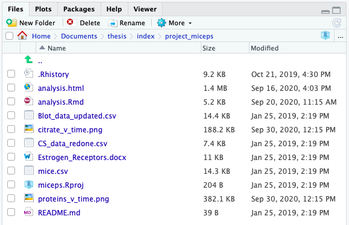
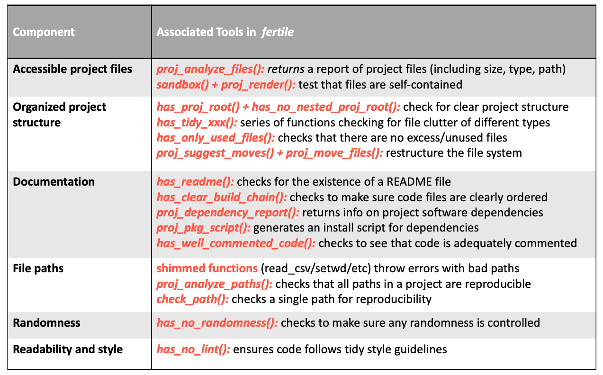
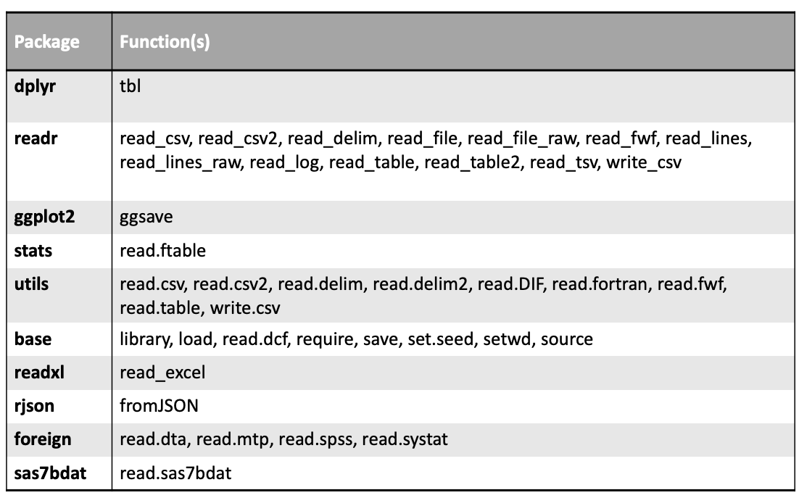

<!-- README.md is generated from README.Rmd. Please edit that file -->

```{r, echo = FALSE, message = FALSE, warning = FALSE}
knitr::opts_chunk$set(
  collapse = TRUE,
  comment = "#>",
  fig.path = "README-"
)

```

```{r, include = FALSE}
library(fertile)
library(tidyverse)


miceps <- system.file("extdata/project_miceps.zip", package = "fertile") %>%
  sandbox()
```


[](https://travis-ci.org/baumer-lab/fertile)
[](https://codecov.io/gh/baumer-lab/fertile?branch=master)
[](https://lifecycle.r-lib.org/articles/stages.html#stable)


# fertile: creating optimal conditions for reproducibility 

**Tools to make achieving R project reproducibility easy!**

## Why `fertile`?

- Addresses all different reproducibility aspects in one place
- Simple functions w/ minimal arguments
- Minimal prior knowledge required
- `R`-specific features
- Customizable to your needs
- Has educational features

## Sample Project 

`miceps`: variable containing path to directory containing following project:



## Easily Create Reproducibility Reports

```{r badges, eval = FALSE}
proj_badges(miceps)
```


$~$


## Run Reproducibility Checks


`fertile` contains 16 checks on different aspects of reproducibility:



$~$

Run them individually or in customizable groupings, w/ `proj_check()`, `proj_check_some()`, or `proj_check_badge()`


```{r}
# Individual check
has_well_commented_code(miceps)
```

```{r}
# Combined checks
proj_check_badge(miceps, "documentation")
```


## Warnings For Potentially Non-Reproducible Commands

```{r, error = TRUE}
read_csv("/Users/audreybertin/Documents/fertile/project_miceps/mice.csv")
```


```{r, error = TRUE}
setwd(miceps)
```

Several data-reading functions built in to `fertile`'s warning system:



$~$

Customize warning system by:

- Adding functions (`add_shim()`, `add_all_possible_shims()`)

```{r addshim, eval = FALSE}
# Add stats::write.ftable to the warning system

add_shim(func = "write.ftable", package = "stats")
```

- Editing functions (`edit_shims()`)
- Disabling warnings for user-added functions (`unload_shims()`)
- Enabling warnings for user-added functions (`load_shims()`) --- this is the *default* setting.


## Installation

You can install `fertile` from GitHub with:

```{r gh-installation, eval = FALSE}
# install.packages("remotes")
remotes::install_github("baumer-lab/fertile")
```


## Citation

```{r citation}
citation("fertile")
```

The `fertile` release at the time of publication for the above citation can be found here: <https://github.com/baumer-lab/fertile/releases/tag/v1.0>
